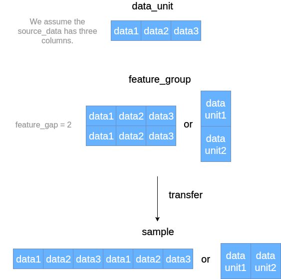
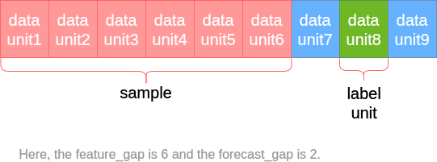

## 数据来源
我们选择上海交易所从1993年1月1日至今的每日大盘K线数据，
在 Python 3.6 下利用 tushare 包的 get_k_data 方法来获得上述**源数据**(*source data*)。  

## 数据组成说明
我们抽取源数据中的五列（源数据共七列），组成如下：
| 列名 | open | close |　high | low | volume |
| --  | --   | --    | --    | --  | --     |
| 解释 | 开盘价 | 收盘价 | 最高价 | 最低价 | 成交量 |
我们把这样的一行五个数据称为一个**数据单元**(*data unit*)，
如此我们能得到6000余个数据组（截止到2018年8月）

## 数据处理
1. 数据归一化处理  
    由于股票数据的数值都比较大，且数据间的差值也比较大，
    如果不进行归一化处理，
    后期的时间序列处理模型可能无法容纳这样的数据，
    直接影响预测结果。

    > 所谓归一化处理，简单理解就是保证所有数据处理后的值能够在区间[0, 1]中。
    
    我们将每一列数据称为**数据列**(*data column*)（共五列），
    并以数据列为单位，
    将列中的每个**数据**(*data*)都按下方的公式进行归一化处理：
    $$ data[i][j] = \frac {data[i][j] - min(data\_col[i])} {max(data\_col[i]) - min(data\_col[i])} $$
    - data[i][j] 表示第i列第j行的数据
    - min(data_col[i]) 表示取第i列的最小值
    - max(data_col[i]) 表示取第i列的最大值
    > 注：在数据处理后可能会出现0的结果，这种结果是不被允许的，
    直接将它的数值改为1即可。
2. 组装**样本**(*sample*)，获取**标签**(*label*)  
   这里先定义几个概念
    - **特征数据组**(*feature group*)  
        用于提取特征的数据单元集合
    - **特征提取步长**(*feature gap*)  
        用于提取特征的数据单元的数量，即样本长度
    - **预测步长**(*forecast gap*)  
        预测步长 = 需要预测的数据单元的位置 - 对应的样本的最后一个数据单元的位置

    我们将一个特征数据组（本质是矩阵）转化为一个向量，如下图：
    

    并将此向量视作一个样本。  
    而标签是一个样本的“正确答案”，
    这里，我们将每个样本对应的数据组中的收盘价作为此样本的标签。

    假设我们能够获得的数据组一共有a个，特征提取步长为b，预测步长为c，
    那么获得的样本数量共
    $$ num(sam) = a - b - c + 1 $$
    对应的，标签数量等于样本数量。

    

    > 在本篇论文实验中，我们将特征提取步长设置为1，预测步长也设置为1，意思就是只使用一天的数据组来预测下一天数据组中的收盘价。  
    假设共获取6000个数据组，那么一共能组成5998个样本和标签

3. 组装**训练样本集**(*train sample set*)、**训练标签集**(*train label set*)、**测试样本集**(*test sample set*)和**测试标签集**(*test label set*)  
    我们将样本集合中最后固定数量（自行定义）个样本归入到测试样本集中，剩下的归入到训练样本集中，
    对标签集也做同样的操作，如此我们就能获得4个用于训练评估模型的数据集合。

## 模型说明
论文实验中一共使用了两种模型：LSTM和ARX

## 结果评估
模型训练结束之后，再导入测试样本集，我们能够获得**预测测试标签集**(*predict test label set*)
最后我们使用 NMSE 算法来分别将两个模型预测的结果与各自的测试样本集进行比较评估  
使用的 NMSE 算法：  
$$ NMSE =  \frac{1}{(len(te\_lab))^{2}} * \sum {\frac{(te\_lab[i] - pre\_te\_lab[i])^{2}}{(te\_lab[i] - mean(te\_lab))^{2}}} $$
- len(te_lab)：表示获得测试标签集的集合长度
- mean(te_lab)：表示获得测试标签集的平均值

## 模型预测结果
以下就是两个模型不同测试样本数量下的NMSE结果
| 样本数量 | LSTM NMSE | ARX NMSE |
| -- | -- | -- |
| 100     |	0.0598958512 |	0.0680873517 |
| 200 	  | 0.0039414761 |	0.0074136101 |
| 300     | 0.0033462509 |	0.0208314032 |
| 400     | 0.0929695217 |	0.1439311236 |
| 500     | 3.6986882273 |	5.9144174260 |
> NMSE的值越小预测效果越好

## 总结
通过一系列的验证，我们可以说，股票数据并不是一个十分严格的时间序列，
由于它受到影响因素比较多，且数据量不是很充足，
使用LSTM来预测数据不能很好地发挥性能，预测结果显得不是特别理想，
部分数据出现了比较大的波动，
但是总体来说，还是完成了基本任务
